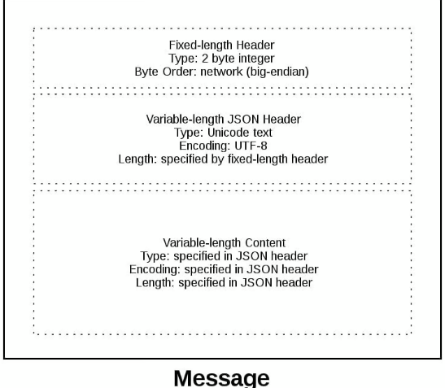

# Introduction

- This section will showcase implement how we can ensure if all data is read and written from and to server.
- We'll also make sure error in one connection doesn't propogate to others

**Problem Statement1**
- Unlike file, we don't know boundaries of data received in single request in sockets
- To read all content of a requests, we'll have to save content to a buffer from multiple `recv` methods
- To define the boundaries of a request, we need to define `applciation layer protocol`. These protocol will define how to read data from a request using common protocol.

**Solution**:
- Common solution is to use `protocol header` used by many protocols like `http`.
- This `header` will be of variable length, since we need to be able to send varying content sizes. 
- We'll define the length of content in a header attached at start of request.


**Problem Statement2**
- Since we're sending over data in bytes, and we want multiple bytes to be interpretted 
- we need to be aware of `byte order` of CPU of host and other side computer. 
    > Byte Order is simply the way in which CPU stores data (also known as endianness). 
    > - Big Endian: most significant bytes are stored first memory location
    > - Little Endian: least significant bytes are stored first memory location
- This will directly impact the way we send our data over network


**Solution**
- We can use `unicode` and use `utf-8` encoding to convert our data into bytes
- `unicode` doesn't face this issue with byte ordering when decoding the bytes


# Protocol Header
Now we're aware our protocol will be of 
- variable length
- unicode utf-8 encoded
- python dictionary (we can easily add more required key-value pairs)

Example, the implementation in current section we'll send over `byte-order`, `content-length`, `content-type` and `content-encoding`.


**Problem Statement**
- How will you identify the variable length header's boundary?

**Solution**
- We can prefix the length of header using 2-bytes since protocol header will be a small message
- this header will be encoded in common network byte order, (either big or little endian)

At the end, our message structure will look like this



# Demo
- The following [server](./app-server.py) and [client](app-client.py) scripts have implemented application with search functionality. 
- The client performs an action with value, and if we find a result we'll return it else if its binary request
 we'll return a binary response


 ```bash

 python app-server 127.0.0.1 8000
 python app-client 127.0.0.1 8000 search morpheus

 ```

# Notes
1. To encode and decode the data in specific byte order, we can use python `struct` module which provide `pack` and `unpack` method to encode and decode as per provided format

2. To encode and decode json data using dynamic encoding, we can use `TextIOWrapper` class from `io` module which allows us to specify the `encoding` of the byte stream and acts like a file-like object which can be used with `json.load()`. To create a stream of bytes in-memory, we can use `io.BytesIO`.