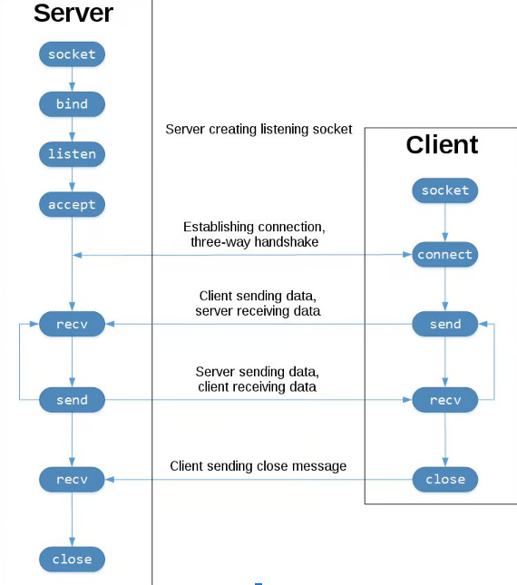

# Introduction
- Socket programming is essential for network communication, enabling data exchange across different devices. 
- In Python, sockets allow for `inter-process communication (IPC)` over networks

# History
- Originated with development of `ARPANET` and later was released as a separate API known as `Berkeley Socket`.
- Even today the underlying low-level API remains the same, even though the protocols have evolved. 
- Common socket applications are `client-server` applications, where the server waits for connections from the client. These application uses `Internet sockets (BSD Sockets)`.  
- The other type is `Unix Domain Sockets` which can be only used to communicate b/w processes on the same host.

# Python Socket API overview
- Python `socket` module provides interface to `BSD API`.
- The primary function are
    - `.socket()`
    - `.bind()`
    - `.listen()`
    - `.accept()`
    - `.connect()`
    - `.connect_ex()`
    - `.send()`
    - `.recv()`
    - `.close()`

## TCP Sockets

- When creating a socket using `socket.socket()`, specifying socket type as `socket.SOCK_STREAM` will default the protocol to `TCP`. 
- Why use `TCP`?
    - `Reliable`, packets dropped in network are detected and retransmitted by sender
    - `In-order data delivery`, data is read in order the sent by sender

> `UDP` can be set using `socket.SOCK_DGRAM` which isn’t as reliable as `TCP` as packets might be droped and data can be `read out of order`

## Flow of request through TCP


- Server sets up a listening socket to listen for communication from clients by selecting a `Socket`, `Bind` to an address, then enable `Listen` mode and wait to `Accept` incoming requests at this socket.
- Client connects to the listening socket using connect which initiates a 3-way handshake. 
- A 3-way handshake (client>server, server>client, client>server) is important to ensure both sides are reachable from either ends.
- `Accept` call is implemented such that it blocks the program until a client is available to connect. 
- After setting up TCP connection, data can be exchanged using `send` and `recv`
- At the end, we close respective sockets when the request is completed.


# Echo Server

1. `socket.socket()` creates a socket object that supports the context manager type, so you can use it in a `with` statement. There’s no need to call `s.close()` when using a `with` statement. 
    - Constant Arguments passed in sockets are
        - `socket.AF_INET` representing the address family of socket is set to `IPv4`.
        - `socket.SOCK_STREAM` representing the default protocol as `TCP` to be used for transport.
2. `Bind` is used to map the socket with a specific network interface and port number.
    - Value passed to bind depends on the address family used in the socket. IPv4 expects (HOST, PORT) tuple .
    - HOST can be hostname, IP Address or empty string.
        - Example, `127.0.0.1` is the standard `IPv4` address for `loopback interface` so that only the process on the same host will be able to communicate. 
        - `Empty string` will accept `all connections` on available IPv4 interface
        - When using `hostname`, the program may show a `non-deterministic behavior`, as Python uses the `first address` returned from the `DNS resolution`. The socket address will be `resolved differently` into an actual IPv4/v6 address, depending on the results from `DNS` resolution and/or the host configuration. `For deterministic behavior use a numeric address in host portion`
    - `PORT` is a `TCP port number` to accept connections from clients. It can be anything from 1-65535. Some systems require superuser privileges for port < 1024.
3. `Listen` enables the server to accept connections. It makes the socket a listening socket
    - It takes an optional parameter `backlog` which specifies the number of connections the socket accepts
    - For handling huge concurrent connections, increase the `backlog` value  to the `maximum length of the queue for pending connections`. The maximum value is system dependent. For example, on Linux, see `/proc/sys/net/core/somaxconn`.
4. `Accept` method blocks program execution and waits for incoming connections. When  a client connects, it returns a new socket object representing the connection and a tuple holding address of the client. 
    - `(host, port)` for `IPv4` connections or `(host, port, flowinfo, scopeid)` for `IPv6`.
    - The new socket will be used to communicate with client,
5. We’ll reuse the communication socket to echo information received from the server indefinitely until we receive no data. 
    - `recv(1024)` gets the data in size of 1024 bytes
    - `sendall` ensures all data submitted in its argument is returned back to client
    - The data being received and send is in bytes, so you may need to used encode and decode respectively.
6. Finally the context manager will close the socket when we move out of its scope\


# Demo

```bash
python echoserver.py
python echoclient.py
```

# Limitation

- It doesn’t handle multiple connections concurrently. 
    Check this limitation implemented in [MultiConnectWebServer](./../MultiConnectWebServer/README.md)
- `.send()` and `.recv()` doesn’t guarantee all the data you’ve submitted or received is returned. You’ll have to check it within your application logic if all of your data is submitted or received. 
    >   For `send` you’ve avoided it for now by using `sendall`
    
    Check its implementation in [AppWebServer](./../AppWebServer/README.md)